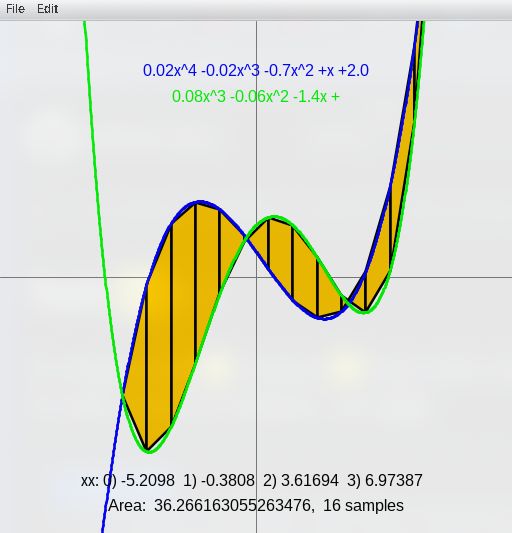

# Exercise #1

## Overview

This repo contains the following `.java` files:
- `Ex1` - most of the functions were written by me (the rest were provided to us.)
- `Ex1Test` - I added my own JUnit tests to all the functions (the preexisting tests were unchanged.)
- `Ex1_GUI` - GUI provided to us (unchanged.)
- `StdDraw` - drawing library provided to us (unchanged.)

It also contains:
- `PseudoCode.txt` - pseudocode for the functions I wrote.
- `output.png` - a screenshot of the output (see below.)

> [!WARNING]
> The pseudocode does not fully reflect the final implementation.

## Execution

To run the project, run (from `I2CS_Ex1/src/`):
```bash
javac Ex1.java Ex1_GUI.java StdDraw.java
java Ex1_GUI
```

> [!NOTE]
> I haven't downloaded the JUnit jar, so I've only run `Ex1Test.java` directly from my IDE.

## Output

The following is a screenshot of the output of `Ex1_GUI`:



## TODO:
- [x] Write pseudocode for all the functions
- [x] Implement tests for all functions
- [x] Actually write the code
- [x] Write documentation
- [x] Write README
- [x] Add screenshot

## Personal notes

In the previous assignment, I included my pseudocode inside the function bodies. This time, I've written it in a separate file.

I wrote my (initial) tests BEFORE implementing the code. This was a new, yet fruitful experience. I also tried to add some edge cases to the test suite.

> [!NOTE]
> I prefer the style of "early returns" (as I find it easier to read than nesting.)

## Explanations

The following functions are a little complicated. The general idea is:

### `poly()`
#### array -> String
1. Ensure the polynomial has coefficients
2. Create an array with `{sign, where appropriate}{coefficient}`
3. Append `{x}{power}` to each element, where appropriate
4. Convert the array to a string
5. Handle edge cases (empty string, leading `+`)
6. Return string

### `getPolynomFromString()`
#### String -> array
1. Split the polynomial into an array (using `space` as the delimiter)
2. Ensure even the first element has a leading sign
3. Find the highest power and create an appropriate array
4. Loop through the array of strings
    - If there's a power (the string includes a caret), insert the coefficient into that position of the array
    - If it's just an x term, insert to the 1st position
    - If it's a constant term, insert to the 0th position
5. Return array
